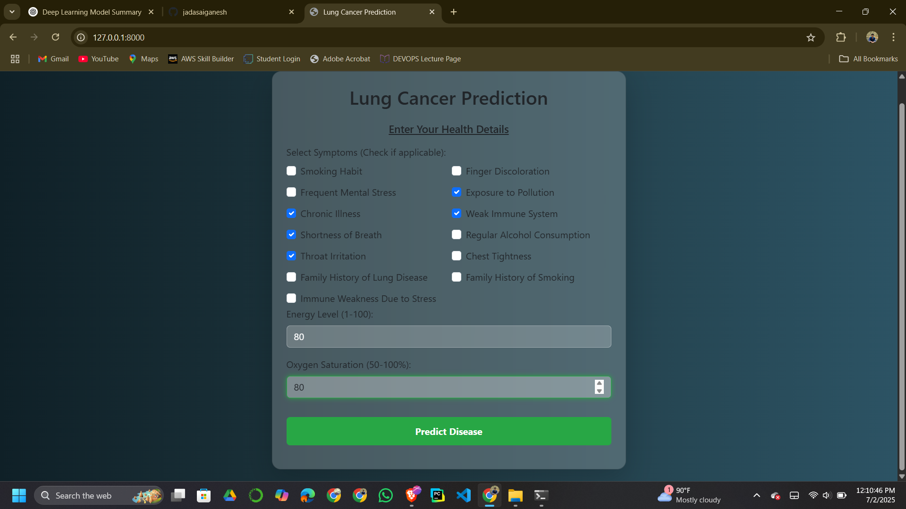
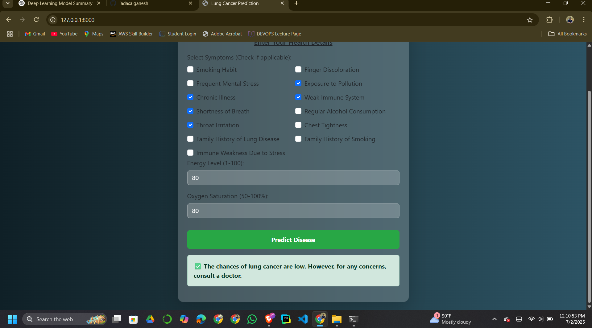

# 🫁 Lung Cancer Prediction Web Application

A machine learning-powered web application that predicts the likelihood of lung cancer based on clinical symptoms and lifestyle indicators.  
Built using a tuned **XGBoost model** and a Django web server, this project aims to provide early risk insights to users.

---

## 🚀 Key Features

- 🎯 **Binary Classification**: Detects high or low lung cancer risk
- 🧠 **Tuned XGBoost Model** for optimal prediction accuracy
- 📑 **Interactive Web Form** built with Django & Bootstrap
- 📊 Uses real-world lung cancer dataset for training
- 🖼️ Web interface with prediction display and result alerts

---

## 🧠 Model Info

- **Model File**:  
  `predictor/models/tuned_xgb_model.pkl`
- **Model Type**: XGBoost Classifier
- **Other Models (optional)**:
  - `stacked_lung_cancer_model.pkl`
> ⚠️ **Important:**  
> The model path in this project is hardcoded as:
> ```python
> MODEL_PATH = r"F:\projects\lung_cancer_app\predictor\models\tuned_xgb_model.pkl"
> ```
> This is specific to the original developer's local system.  
> After cloning or downloading this project, **you must update the `MODEL_PATH`** in your code to match the correct path on your own machine.  
>  
> ✅ Tip: If you keep the folder structure unchanged, you can use a relative path like:
> ```python
> MODEL_PATH = 'predictor/models/tuned_xgb_model.pkl'
> ```

---

## 📥 Dataset

- **File**: `Lung Cancer Dataset.csv`
- Includes symptoms, energy level, oxygen saturation, and labels indicating cancer diagnosis.
- Used in the `lung cancer.ipynb` notebook for model training and tuning.

---

## 🏥 Health Inputs

### ✅ Symptom Checkboxes:
- Smoking Habit  
- Finger Discoloration  
- Frequent Mental Stress  
- Exposure to Pollution  
- Chronic Illness  
- Weak Immune System  
- Shortness of Breath  
- Regular Alcohol Consumption  
- Throat Irritation  
- Chest Tightness  
- Family History of Lung Disease  
- Family History of Smoking  
- Immune Weakness Due to Stress  

### 🔢 Numeric Fields:
- **Energy Level (1–100)**  
- **Oxygen Saturation (50–100%)**

---

## 📈 Prediction Output

> Sample output after form submission:

✅ **"The chances of lung cancer are low. However, for any concerns, consult a doctor."**  
⚠️ **"There is a high risk of lung cancer. Please consult a healthcare professional immediately."**

---

## 🖼️ Web App Interface

### 🔹 Home Page (Input Form)


### 🔹 Symptoms Selection


### 🔹 Prediction Result


---

## 🛠️ How to Run Locally

### 1️⃣ Clone the Repository
```bash
git clone https://github.com/jadasaiganesh/Lung_Cancer_Prediction.git
cd Lung_Cancer_Prediction
```
### 2️⃣ Set Up Virtual Environment
```
python -m venv venv
venv\Scripts\activate      # Windows
# or
source venv/bin/activate   # Linux/macOS
```
### 3️⃣ Install Required Packages
```
pip install -r requirements.txt
```
### 4️⃣ Run Django Server

```
python manage.py runserver
Visit 👉 http://127.0.0.1:8000/ to use the app.
```
---

## 📁 Project Structure
```
Lung_Cancer_Prediction/
│
├── db.sqlite3
├── Lung Cancer Dataset.csv
├── lung cancer.ipynb
├── manage.py
├── README.md
│
├── images/
│   ├── 1.png
│   ├── 2.png
│   └── 3.png
│
├── lung_cancer_app/
│   ├── settings.py, urls.py, views.py, ...
│   └── static/
│
├── predictor/
│   ├── models/
│   │   ├── tuned_xgb_model.pkl
│   │   └── stacked_lung_cancer_model.pkl
│   ├── templates/
│   │   ├── homepage.html
│   │   └── test.html
│   ├── urls.py, views.py, ...
│
└── static/
```
---

## 📬 Contact

- 👨‍💻 **Developer**: Sai Ganesh J  
- 📧 **Email**: [jadasaireddy@gmail.com](mailto:jadasaireddy@gmail.com)  
- 🔗 **GitHub**: [@jadasaiganesh](https://github.com/jadasaiganesh)  
- 🔗 **LinkedIn**: [saiganeshjada](https://www.linkedin.com/in/saiganeshjada)

---

## ⚠️ Disclaimer

This application is developed for **educational and awareness purposes only**.  
It does **not substitute professional medical advice**. Please consult a licensed physician for any health concerns.
